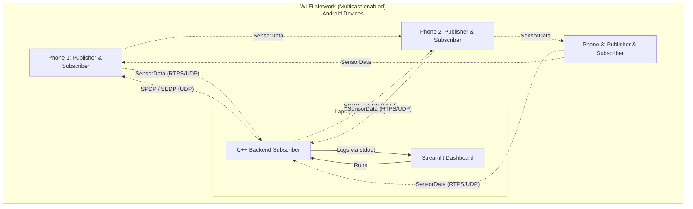

# Báo Cáo Kỹ Thuật: DDS Mesh Demo v2
**Đơn vị:** Bee Labs
**Mục tiêu:** Thử nghiệm giao thức DDS (Data Distribution Service) để xây dựng hệ thống thu thập dữ liệu ngang hàng (P2P), thay thế kiến trúc Client-Server truyền thống cho hệ thống thiết bị di động nội bộ.

---

## 1. Vấn đề & Lý do chọn DDS
### 1.1 Khuyết điểm của hệ thống cũ (MQTT/HTTP)
- Phụ thuộc vào Server trung tâm (Broker). Khi Broker sập, toàn bộ thiết bị mất kết nối.
- Độ trễ cao khi thiết bị nằm cạnh nhau nhưng phải gửi dữ liệu vòng qua Server trên Cloud.
- Khó cấu hình linh hoạt (Dynamic Discovery) cho các mạng ad-hoc di động.

### 1.2 Giải pháp Fast DDS
- Giao thức **DDS** (phân phối dữ liệu phi tập trung) kết nối các node trực tiếp qua **Multicast/Unicast**.
- Hỗ trợ **Dynamic Discovery** (SPDP/SEDP) tự động nhận diện thiết bị mới tham gia mạng, không cần cấu hình IP tĩnh tĩnh.
- Cung cấp cơ chế **QoS (Quality of Service)** mạnh mẽ, tùy chỉnh được Reliability, History, Liveliness.

## 2. Kiến trúc Hệ Thống Many-to-Many
Hệ thống thử nghiệm áp dụng mô hình phân tán hoàn toàn (Many-to-Many).
Mọi thiết bị (Điện thoại Android, Laptop Dashboard) đều vừa có thể đóng vai trò là `Publisher` và `Subscriber`.

### Thành phần:
1. **Android App (C++ JNI + Kotlin):** Khởi tạo `DataWriter` để gửi dữ liệu và `DataReader` để nhận dữ liệu song song. Lấy ID động bằng `Build.MODEL`.
2. **Backend Node (C++):** Chạy ngầm bằng Native Windows 11 để nhận bản tin từ các thiết bị và parse ra JSON log.
3. **Streamlit Dashboard (Python):** Đọc Log từ Backend, lưu vào SQLite và vẽ biểu đồ Latency, Packet Loss, trạng thái kết nối thời gian thực.

## 3. Khả Năng Chịu Lỗi (Fault Tolerance) & QoS
Để đáp ứng yêu cầu chịu lỗi khắt khe, cấu hình QoS được thiết lập như sau:
- **Liveliness (AUTOMATIC):** Cài đặt `Lease Duration` 3 giây và `Announcement Period` 1 giây. Khi một thiết bị tắt mạng hoặc sập, hệ thống ngay lập tức phát hiện (thông qua hàm `on_liveliness_changed`) và chuyển thiết bị sang trạng thái OFFLINE trên Dashboard.
- **Reliability (RELIABLE):** Được dùng để đảm bảo không mất gói tin quan trọng qua môi trường sóng Wi-Fi nhiễu.

## 4. Đặc tả Giao Tiếp JNI
App Android sử dụng JNI để gói thư viện FastDDS C++.
Quá trình gửi callback từ C++ Thread về Java/Kotlin UI Thread cần đính kèm JNI `AttachCurrentThread` và sau đó sử dụng `runOnUiThread` ở phía Kotlin để update UI mượt mà, tránh lỗi sập ngầm. Đồng thời cấp `MulticastLock` để SPDP qua mạng LAN Wi-Fi không bị Android chặn.

## 5. Kết Luận
Bản demo đã hiện thực hóa thành công mạng Mesh P2P giữa các thiết bị Android và Laptop. Khả năng phát hiện node chết tự động, cùng kết nối Many-to-many mở ra tiềm năng cho việc triển khai vào các mạng di động Ad-hoc, Drone swarms, và giám sát cảm biến nội bộ.
