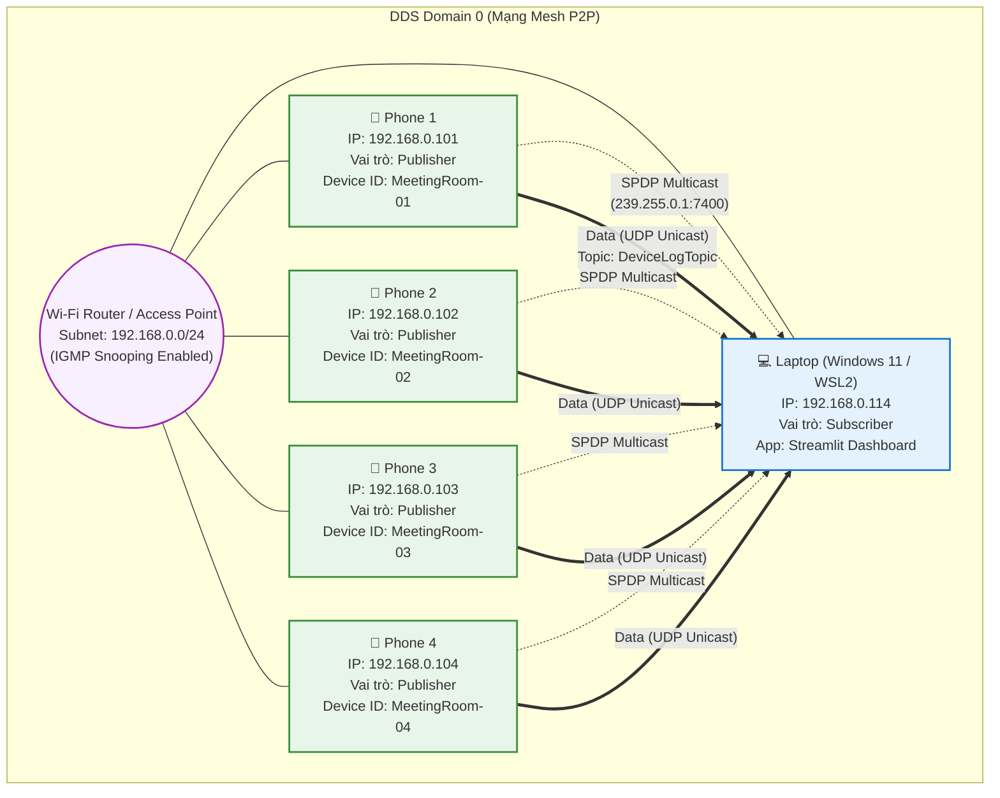

# Sơ đồ Topology Mạng: P2P DDS Mesh (Giai đoạn 3)

Dưới đây là sơ đồ kiến trúc mạng DDS Mesh không máy chủ (Brokerless) cho hệ thống gồm 1 Laptop và 4 Phone.

## Thông số Mạng Chung
- **Wi-Fi Access Point (LAN):** Subnet `192.168.0.0/24`
- **DDS Domain ID:** `0` (Tất cả thiết bị phải cùng Domain ID để thấy nhau)
- **Giao thức Discovery (SPDP):** UDP Multicast địa chỉ `239.255.0.1`, Cổng `7400`
- **Giao thức Dữ liệu (SEDP/User Data):** UDP Unicast P2P trực tiếp giữa các thiết bị.

## Sơ đồ Mermaid Topology

## Giải thích chi tiết vai trò (Roles)

1. **📱 Phone 1, 2, 3, 4 (Android 14)**
   - **Vai trò DDS:** `Publisher` (DataWriter)
   - **Nhiệm vụ:** Hoạt động như các trạm cảm biến môi trường độc lập. Liên tục sinh ra dữ liệu giả lập (Nhiệt độ, Độ ẩm, CO2, v.v.) và đẩy (publish) vào Topic `DeviceLogTopic`.
   - **Định danh (Device ID):** Lần lượt là `MeetingRoom-01`, `MeetingRoom-02`, `MeetingRoom-03`, `MeetingRoom-04`.
   - **Đặc tả Mạng:** Đã xin cấp quyền `MulticastLock` để có thể nhận và gửi bản tin Discovery đa hướng. Khi mới kết nối mạng, chúng sẽ rải bản tin ra toàn bộ mạng LAN để tìm kiếm Subscriber.

2. **💻 Laptop (WSL2 Ubuntu 24.04)**
   - **Vai trò DDS:** `Subscriber` (DataReader)
   - **Nhiệm vụ:** Khởi chạy Fast DDS Backend (C++) để lắng nghe thụ động trên Topic `DeviceLogTopic`. Bất cứ gói tin nào từ 4 phòng (Phone) bay tới sẽ được bắt lấy, chuyển thành JSON và đẩy lên màn hình Streamlit Dashboard.
   - **Đặc tả Mạng:** Nhờ chế độ `Mirrored Networking`, WSL2 nhận chung IP `192.168.0.114` của máy chủ Windows và có thể "bắt sóng" (sniff) được các bản tin Multicast từ điện thoại gửi vào mạng LAN.

> [!TIP]
> **Đặc quyền của mạng Mesh (DDS):** Không có thiết bị nào đóng vai trò là "Máy chủ trung tâm" (Broker/Server). Nếu Laptop (Dashboard) bị tắt, 4 chiếc điện thoại vẫn hoạt động và duy trì kết nối mạng bình thường. Ngay khi Laptop mở lại, chúng sẽ tự động khám phá (Auto-Discovery) ra nhau và tiếp tục luồng dữ liệu ngay lập tức (Plug & Play).
