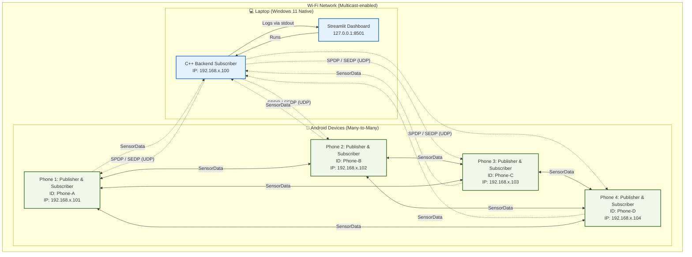

# DDS Mesh Demo - Topology

Sơ đồ dưới đây mô tả kiến trúc mạng và ứng dụng của hệ thống DDS Mesh Demo, triển khai trên môi trường mạng thực tế (Phase C).

> [!NOTE]
> **Kiến trúc No-Broker (Nguyên tắc ngang hàng P2P)**
> Khác với MQTT hay AMQP cần một server trung tâm (Broker/Mosquitto) để phân phối bản tin, hệ thống DDS Mesh này hoàn toàn phi tập trung (Decentralized). Các node tự động tìm thấy nhau qua mạng (SPDP) và trực tiếp trao đổi dữ liệu với nhau (SEDP). Nếu một thiết bị ngắt kết nối hoặc hỏng, toàn bộ mạng vẫn tiếp tục hoạt động bình thường, không có điểm lỗi đơn lẻ (Single Point of Failure).

## Sơ Đồ Topology

## Thông số mạng chung
- **DDS Domain ID:** 0 (Mặc định)
- **Topic:** `SensorData`
- **Discovery Mechanism (SPDP):** Simple Participant Discovery Protocol.
  - Sử dụng UDPv4 Multicast trên địa chỉ chuẩn của DDS: `239.255.0.1`, Port: `7400` (theo công thức PB = 7400 + 250 * DomainID).
- **Data Exchange (SEDP):** Simple Endpoint Discovery Protocol truyền dữ liệu qua giao thức RTPS (Real-Time Publish-Subscribe).
- **Reliability QoS:**
  - Android Publisher: `RELIABLE`
  - Android Subscriber: `RELIABLE`
  - Backend Subscriber (Laptop): `RELIABLE` (để hứng đủ log).
- **Liveliness QoS:**
  - Kind: `AUTOMATIC_LIVELINESS_QOS`
  - Lease Duration: 10s (Sau 10s không thấy tín hiệu, node sẽ bị đánh dấu Offline).
  - Announcement Period: 3s.

## Vai trò từng loại thiết bị

### 1. 💻 Laptop (Native Windows 11)
- **C++ Backend Node:** Đóng vai trò là một **Subscriber** chuyên biệt. Lắng nghe các bản tin SPDP/SEDP trên toàn mạng để xây dựng danh sách các thiết bị tham gia (Peers). Nó thu thập bản tin `SensorData` từ tất cả các Phone và in ra dạng JSON Logs qua stdout.
- **Streamlit Dashboard:** Đọc luồng JSON Logs từ Backend Node, phân tích và render biểu đồ Real-time (Latency, Packet Loss, Nhiệt độ, Độ ẩm) cũng như hiển thị trạng thái kết nối (MATCHED / OFFLINE) dựa trên Liveliness QoS.

### 2. 📱 Các thiết bị Android (Phone 1, 2, 3, 4)
- **Đóng vai trò Publisher:** Tạo ra dữ liệu giả lập (Nhiệt độ, độ ẩm, % pin) và gửi bản tin `SensorData` lên mạng lưới.
- **Đóng vai trò Subscriber:** Đồng thời lắng nghe bản tin `SensorData` từ *các Phone khác* (Many-to-many topology). Khi một Phone nhận dữ liệu của Phone khác, nó sẽ tính toán độ trễ (Latency) và hiển thị trực tiếp trên giao diện của Phone đó.
- **Device ID:** Cấu hình tự động theo tên máy hoặc người dùng nhập (ví dụ: Phone-A, Phone-B), tuyệt đối không dùng hardcode cứng cho mọi máy.
