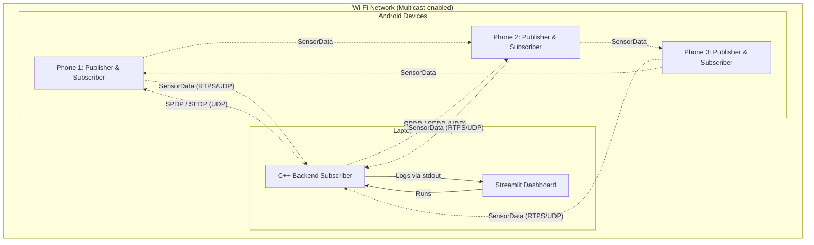

# DDS Mesh Demo - Topology
This diagram describes the network and application topology for the DDS Mesh Demo system.

## Details
- **Domain ID:** 0 (Default)
- **Topic:** SensorData
- **Discovery Mechanism:** Simple Participant Discovery Protocol (SPDP) over UDPv4 Multicast
- **Data Exchange:** Simple Endpoint Discovery Protocol (SEDP) over RTPS
- **Reliability QoS:**
  - Android Publisher: RELIABLE
  - Android Subscriber: RELIABLE
  - Backend Subscriber: BEST_EFFORT (or RELIABLE depending on config)
- **Liveliness QoS:** AUTOMATIC (Lease Duration 3s, Announcement Period 1s)
